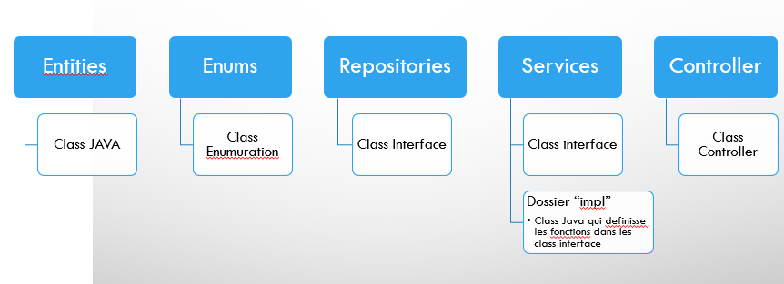

  

<h6 align="center">
  
</h6> 
 
<h1 align="center"> SpringBoot Application </h1>

<h2> * There are only one who can use this student absence managment application : </h2> 

- School or university adminstrator officer  

<h2> * Adminstrator officer role: </h2>  

- Add groups.
- Add students.
- Add Subjects.
- Add students to the groups.
- Add Sujects to the groups. 
- Add absence for each 

<h2> About the application: (FR-fr) </h2> 

<h3 align="center"> ** Class Diagram ** </h3>   

<h3 align="center"> ** Use Case Diagram ** </h3>   

<h3 align="center"> ** Global application architecture  ** </h3>   

<h3 align="center"> ** Environment of development ** </h3>   
